# ✍️ AI Content Generation Pipeline
### *A Multi-Agent Editorial Engine Powered by CrewAI & DeepSeek-V3*

[](https://github.com/Ismail-2001)
[](https://www.crewai.com/)
[](https://www.deepseek.com/)
[](LICENSE)

---

## 🎬 Overview
This isn't another "GPT wrapper." The **AI Content Generation Pipeline** is a **production-ready, multi-agent orchestration system** that mirrors a real editorial newsroom. Five specialized AI agents collaborate in a sequential cognitive loop to research, write, edit, fact-check, and SEO-optimize high-quality long-form content — autonomously.

---

## 🏗️ The Intelligence Architecture
Each agent's output becomes the strategic context for the next, creating a **layered intelligence pipeline**:

```mermaid
graph LR
    Input[📝 User Topic] --> A1[🔍 Senior Research Analyst]
    A1 -->|Research Report| A2[✍️ Expert Content Writer]
    A2 -->|Draft Article| A3[📝 Senior Content Editor]
    A3 -->|Refined Draft| A4[✅ Professional Fact Checker]
    A4 -->|Verified Content| A5[📈 SEO Optimization Expert]
    A5 --> Output[🎯 Publication-Ready Article]

    style A1 fill:#1a1a2e,stroke:#00ff00,color:#fff
    style A2 fill:#1a1a2e,stroke:#00bfff,color:#fff
    style A3 fill:#1a1a2e,stroke:#ff9900,color:#fff
    style A4 fill:#1a1a2e,stroke:#ff3333,color:#fff
    style A5 fill:#1a1a2e,stroke:#cc66ff,color:#fff
```



---

## 🚀 Key Features
| Feature | Description |
| :--- | :--- |
| **Multi-Agent Orchestration** | 5 specialized CrewAI agents with state handoffs and sequential reasoning. |
| **Deep Research** | Real-world web searching via DuckDuckGo for up-to-date facts and statistics. |
| **Quality Assurance** | Dedicated Editor and Fact-Checker agents ensure accuracy and punchy prose. |
| **SEO Optimization** | Integrated SEO agent optimizes headers, keywords, and meta-structures. |
| **Premium Streamlit UI** | Sleek, dark-mode dashboard for monitoring agent progress in real-time. |
| **Version Control** | Automatic saving of content versions with heuristic-based quality scoring. |

---

## 📊 Sample Output
```
📝 Topic: "The Future of Autonomous AI Agents in Healthcare"

🔍 Research Agent: Found 23 peer-reviewed sources, 5 expert quotes.
✍️ Writer Agent:  Generated 2,400-word long-form article.
📝 Editor Agent:  Reduced passive voice by 40%, improved readability score to 78.
✅ Fact-Checker:  Verified 100% of statistical claims against source material.
📈 SEO Agent:     Optimized for 12 target keywords, meta-description generated.

✅ Final Quality Score: 94/100
```

---

## 🛠️ Tech Stack
| Layer | Technology |
| :--- | :--- |
| **Frontend** | [Streamlit](https://streamlit.io/) (Premium Custom CSS) |
| **Agent Framework** | [CrewAI](https://www.crewai.com/) |
| **LLM Engine** | [DeepSeek-V3](https://www.deepseek.com/) via LangChain |
| **Research Tools** | DuckDuckGo Search API |
| **Runtime** | Python 3.12 |

---

## 🏁 Quick Start
### Prerequisites
- Python 3.12+
- DeepSeek API Key

### Setup
```bash
git clone https://github.com/Ismail-2001/Content-Generation-Pipeline-Agent.git
cd Content-Generation-Pipeline-Agent
python -m venv venv
source venv/bin/activate  # On Windows: venv\Scripts\activate
pip install -r requirements.txt
```

### Configuration
Create a `.env` file:
```env
DEEPSEEK_API_KEY=your_deepseek_api_key_here
```

### Run
```bash
streamlit run app.py
```

---

## 🗺️ Roadmap
- [ ] Multi-Model Support (GPT-4o, Claude 3.5 Sonnet)
- [ ] Auto-generated cover images via DALL-E 3
- [ ] One-click export to WordPress, Medium, Ghost
- [ ] Custom Brand Voice / Style Guide uploads
- [ ] Analytics dashboard for content performance tracking

---

## 🤝 Contributing
Contributions are welcome! Please follow these steps:
1. Fork the Project
2. Create your Feature Branch (`git checkout -b feature/AmazingFeature`)
3. Commit your Changes (`git commit -m 'feat: add amazing feature'`)
4. Push to the Branch (`git push origin feature/AmazingFeature`)
5. Open a Pull Request

---

## 📄 License
Distributed under the MIT License. See `LICENSE` for more information.

---

### 🔗 Connecting the Intelligence
Developed by **[Ismail Sajid](https://ismail-sajid-agentic-portfolio.netlify.app/)**.
*Explore more Autonomous Agents on my [Main Profile](https://github.com/Ismail-2001).*

⭐ **Star this repo if you find it useful!**
